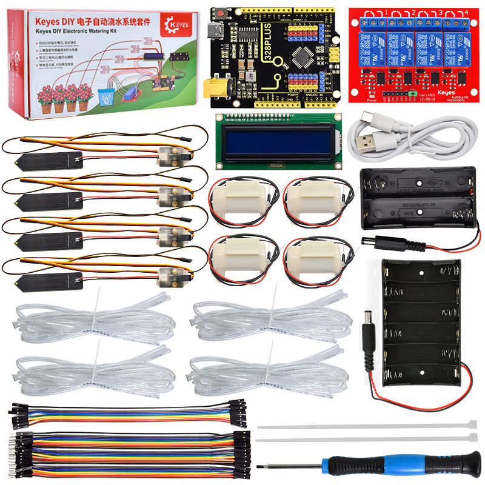
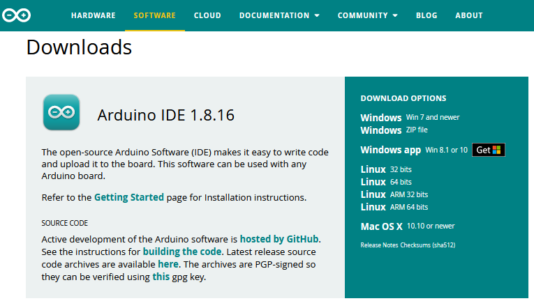
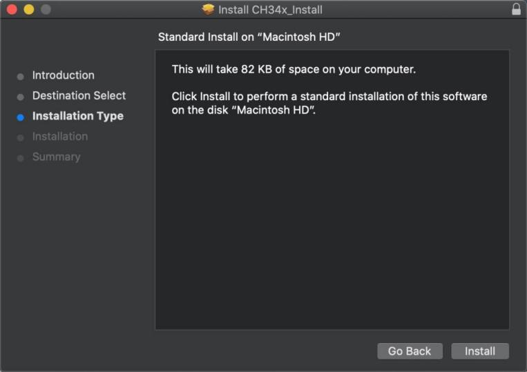
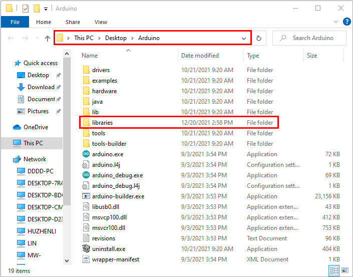
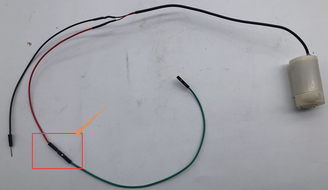
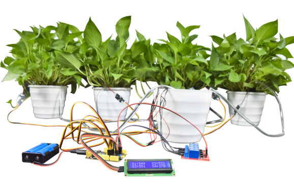

# Arduino C教程

**Arduino软件下载安装，驱动安装和库文件添加**



## 第一小节 控制板简介

我们先了解浇花系统的核心：控制板


控制板的主控芯片是ATmega328PB-AU。和官网的Arduino uno对比，控制板使用的USB转串口芯片为CH340，其他的使用方法完全一样。它具有14路数字输入/输出口（其中6路可作为PWM输出），8路模拟输入，通信IO有IIC、SPI、UART;为了方便接线扩展了传感器排针接口。其中ICSP接口用来给控制板烧录固件。供电方式有USB线供电或DC端供电。

### 规格参数

主控芯片：ATmega328PB-AU

USB转串口芯片：CH340

工作电压：5V

外接电源: DC 6-15V（建议9V）

数字I/O引脚: 14 (D0-D13)

PWM通道： 6 (D3 D5 D6 D9 D10 D11)

模拟输入通道（ADC）: 8(A0-A7)

每个I/O直流输出能力: 20 mA

3.3V端口输出能力: 最大150 mA

Flash Memory: 32 KB

SRAM:2 KB (ATmega328PB-AU)

EEPROM:1 KB (ATmega328PB-AU)

时钟速度: 16MHz

板载LED引脚: D13

### 各个接口和主要元件说明


### 特殊功能接口说明

串口通信接口：D0为RX、D1为TX

PWM接口（脉宽调制）：D3 D5 D6 D9 D10 D11

外部中断接口：D2(中断0)和D3 (中断1)

SPI通信接口：D10为SS、D11为MOSI、D12为MISO、D13为SCK

IIC通信端口：A4为SDA、A5为SCL

## 第二小节 在Windows系统电脑使用方法 


### 1.下载安装arduino软件：

（1）首先，进入arduino官方网站：[<u>https://www.arduino.cc/</u>](https://www.arduino.cc/)
，点击“SOFTWARE”进入下载页面，如下图所示：




（2）然后，根据你的操作系统选择并下载相应的安装程序。如果你是Windows用户，请选择“Windows安装程序”下载正确的安装驱动程序。


选择点击Windows Win7 and newer下载Arduino 1.8.16版本的安装程序，需要手动安装。当我们点击，代表直接下载1.8.16版本Arduino IDE，是一个压缩文件，解压就可以使用，无需安装。


一般情况下，点击JUST DOWNLOAD就可以下载了，当然如果你愿意，你可以选择小小的赞助，以帮助伟大的Arduino开源事业。

（3）Arduino软件下载完成后，继续安装，当你收到操作系统的警告时，请允许驱动程序安装。首先点击I Agree, 然后选择好要安装的组件后再点击Next。


（4）选择安装目录(我们建议保持默认目录)，然后点击Install。


（5）如果出现以下界面，则应选择Install。


该过程将提取并安装所有必需的文件，以正确执行Arduino软件(IDE)。


安装完成后，会在桌面上生成一个Arduino 软件快捷方式。


### 2.安装驱动：

（注意：如果电脑已经安装了CH340驱动程序，则不需要再安装驱动；如果没有，则需要进行以下操作）

安装Arduino IDE后，我们就开始安装驱动。将控制板用USB线连接在电脑上后，如果是Windows10系统电脑，电脑会自动安装驱动。如果是其他系统电脑，如Windows7系统电脑，需要手动安装驱动。

控制板的USB转串口芯片为CH340我们需要安装这芯片的驱动，驱动为usb_ch341_3.1.2009.06。第一次将控制板连接电脑时，点击计算机--属性--设备管理器，显示如下图。


点击
后，点击“更新驱动程序”
，开始安装驱动，如下图。


进入下图，选择


在电脑中找到usb_ch341_3.1.2009.06文件夹。


安装驱动完成，出现下图点击关闭。


这样驱动就装好了。点击计算机--属性--设备管理器，我们可看见如下图。


### 3.配置Arduino IDE

驱动程序安装成功后，接下来配置Arduino IDE 设备和端口。对于328 PLUS主板，单击Tools→Board；选择Arduino Uno (如下图所示)。


然后选择正确的COM端口。驱动安装成功后，可以看到对应的COM口。

单击Tools→Port→COM6


将代码程序上传到控制板之前，必须演示Arduino IDE工具栏中出现的每个符号的功能。


A - 用于检查是否存在任何编译错误。

B - 用于将程序上传到Arduino控制板。

C - 用于创建新草图的快捷方式。

D - 用于直接打开示例草图之一。

E - 用于保存草图。

F - 用于从板接收串行数据并将串行数据发送到板的串行监视器。

### 4.开始第一个程序

打开“File”选择“Examples”，从“Basics”中选择“Blink”，如下图所示：


当草图（Blink）窗口打开时，你可以在窗口中看到整个程序。


设置板型和COM口，对应的板型和COM口会显示在IDE的右下角。


点击开始编译程序，检查错误。


点击上传程序，几秒种后，上传成功。


上传程序成功，利用USB线上电，328 PLUS主板上的板载LED灯点亮1秒，熄灭1秒，循环进行。恭喜你，完成了第一个项目。

## 第三小节 在MAC 系统电脑上使用方法 


### 1.下载安装arduino软件：

下载安装说明与1.1章相同，如下图所示：


### 2.安装CH340驱动： 

(1)点击V1.5 CH340 MaxOS驱动程序包


（2）单击安装包并点击继续


（3）点击安装



（4）输入用户密码，然后单击“安装软件


（5）点击继续安装


（6）等待安装


（7）安装完成后，单击“重新启动”


### 3.设置Arduino IDE:

除了COM端口之外，设置方法与第1.4章相同，如下图所示：


## 第四小节 导入arduino库文件

在开始课程之前我们还需要安装课程里面代码需要的Arduino库文件。

### 1.什么是库文件?

库是一组代码，可以方便地连接到传感器、显示器、模块等。例如，内置的LiquidCrystal库可以帮助与LCD显示器对话。Internet上还有数百个额外的库可供下载。参考资料(https://www.arduino.cc/en/Reference/Libraries)中列出了内置库和其中一些附加库。

### 2.如何安装库 ?

这里我们将介绍一种最简单的添加库的方法 .

第一步：打开文件的安装目录，如下所示：


第二步：
单击打开安装目录下的libraries文件夹，你可以看到library这个文件夹里面含有一些Arduino的库文件。




第三步：打开我们提供的资料里面的Arduino Libraries文件夹，将文件夹中的库文件都复制粘贴到第二步我们打开的libraries文件夹内。


复制好了之后我们的库文件就添加成功了。


这样，库文件就手动添加完成了。


## 总接线图


水管接到水泵上：


母对母的杜邦线接到水泵的正极也就是红色线，再与主板的5V排针连接。



## 代码编写教程

### 实验一：控制继电器和水泵

（1）实验说明：

继电器就是个电动开关，水泵是动力装置。通过继电器开关来控制水泵是否抽水。

（2) 规格参数：

|水泵|水泵|继电器|继电器|
|-|-|-|-|
|工作电压：|2.5V~6V|工作电压|DC5V|
|配对的水管内径|6mm|通过最大电流|10A(AC)  5A(DC)|
|当电压为5V时|水管离水泵的高度不能高于105cm|通过最大开关电压|250VAC  30VDC|
|||触发信号|高电平触发|


（3）实验代码：


```
##define IN1 3
##define IN2 5
##define IN3 6
##define IN4 9

void setup() {
  pinMode(IN1, OUTPUT);
  pinMode(IN2, OUTPUT);
  pinMode(IN3, OUTPUT);
  pinMode(IN4, OUTPUT);
}

void loop() {
  digitalWrite(IN1, HIGH);//打开水泵1
  digitalWrite(IN2, HIGH);//打开水泵2
  digitalWrite(IN3, HIGH);//打开水泵3
  digitalWrite(IN4, HIGH);//打开水泵4
  delay(3000);            //延时3S
  digitalWrite(IN4, LOW);//关闭水泵1
  digitalWrite(IN3, LOW);//关闭水泵2
  digitalWrite(IN2, LOW);//关闭水泵3
  digitalWrite(IN1, LOW);//关闭水泵4
  delay(1000);            //延时1S
}

```


（4）实验现象：

烧录代码之后，可以看到4个继电器同时打开，水泵开始抽水，3秒后停止。

### 实验二 读取土壤传感器检测数值

（1）实验说明：

土壤湿度传感器就是用来检测土壤湿度值的，也就是通过检测到的值可以判断盆栽是否缺水；读取4个土壤湿度传感器，并且在arduino IDE的串口监视器中打印出来。

2.  规格参数

控制芯片：TLC555

通信接口：输出模拟值

额定电压：3.3 ~ 5.5 VDC

输出电压：0 ~ 3.0 VDC

工作电流：\<5mA

工作温度范围：1°C ~ 50°C

（3）实验代码：

```
##define soilPin1 A0   //定义土壤传感器引脚
##define soilPin2 A1
##define soilPin3 A2
##define soilPin4 A3

void setup() {
  Serial.begin(9600);
  pinMode(soilPin1, INPUT);   //设置引脚输出
  pinMode(soilPin2, INPUT);
  pinMode(soilPin3, INPUT);
  pinMode(soilPin4, INPUT);
}

void loop() {
  int val1 = analogRead(soilPin1);
  int val2 = analogRead(soilPin2);
  int val3 = analogRead(soilPin3);
  int val4 = analogRead(soilPin4);
  Serial.print("SoilSensor 1 =  ");     //串口打印土壤湿度值
  Serial.print(val1);
  Serial.print("  ");
  Serial.print("SoilSensor 2 =  ");
  Serial.print(val2);
  Serial.print("  ");
  Serial.print("SoilSensor 3 =  ");
  Serial.print(val3);
  Serial.print("  ");
  Serial.print("SoilSensor 4 =  ");
  Serial.println(val4);
}
```

（4）实验现象：

烧录好代码，打开arduino IDE的串口监视器，可以看到打印出4个土壤湿度传感器检测到的值，用手触摸土壤湿度传感器的探测部分，可以看到对应的值变小，这是因为人的手皮肤上有水分，也就意味着土壤越湿测到的值越小。


### 实验三 简单自动浇花装置

（1）实验介绍：

既然学会了控制水泵和读取土壤湿度传感器的值，那就可以通过判断土壤湿度传感器检测到的值来开关继电器，实现简单的自动浇花装置。

（2）实验代码：


```
##define soilPin1 A0   //定义土壤传感器引脚
##define soilPin2 A1
##define soilPin3 A2
##define soilPin4 A3
##define IN1 3     //定义继电器引脚
##define IN2 5
##define IN3 6
##define IN4 9

void setup() {
  Serial.begin(9600);
  pinMode(soilPin1, INPUT);  //设置引脚为输入
  pinMode(soilPin2, INPUT);
  pinMode(soilPin3, INPUT);
  pinMode(soilPin4, INPUT);
  pinMode(IN1, OUTPUT);     //设置引脚为输出
  pinMode(IN2, OUTPUT);
  pinMode(IN3, OUTPUT);
  pinMode(IN4, OUTPUT);
}

void loop() {
  int val1 = analogRead(soilPin1);
  int val2 = analogRead(soilPin2);
  int val3 = analogRead(soilPin3);
  int val4 = analogRead(soilPin4);
  Serial.print("SoilSensor 1 =  "); //串口打印湿度数值
  Serial.print(val1);
  Serial.print("  ");
  Serial.print("SoilSensor 2 =  ");
  Serial.print(val2);
  Serial.print("  ");
  Serial.print("SoilSensor 3 =  ");
  Serial.print(val3);
  Serial.print("  ");
  Serial.print("SoilSensor 4 =  ");
  Serial.println(val4);
  if(val1 < 420){                    //当土壤传感器检测到湿度值大于420时打开水泵
    digitalWrite(IN1, HIGH);
  }else{
    digitalWrite(IN1, LOW);
  }
  if(val2 < 420){
    digitalWrite(IN2, HIGH);
  }else{
    digitalWrite(IN2, LOW);
  }
  if(val3 < 420){
    digitalWrite(IN3, HIGH);
  }else{
    digitalWrite(IN3, LOW);
  }
  if(val4 < 420){
    digitalWrite(IN4, HIGH);
  }else{
    digitalWrite(IN4, LOW);
  }
}
```

（3）实验现象：

为了方便做实验，我们还是先用手触摸土壤湿度传感器来替代盆栽缺水的情况。烧录代码后，用手触摸土壤湿度传感器，对应的继电器打开，水泵抽水，放开手后，继电器关闭，水泵停止抽水。

### 实验四 控制LCD1602显示屏

（1）简介

这是一个可以显示2行，每行16个字符的液晶屏模块。液晶屏显示蓝底白字，自带I2C通信模块，使用时只需连接单片机I2C通信接口，大大节约了单片机资源。I2C通信模块上带有1个电位器，可用于调节显示屏背光，通信地址默认为0x27。

（2）实验代码：

```
##include <Wire.h> 
##include <LiquidCrystal_I2C.h>

LiquidCrystal_I2C lcd(0x27,16,2);  //LCD的IIC通信地址是0x27,2行显示16个字符

void setup()
{
  lcd.init();                      // 初始化LCD
  lcd.init();
  // 将信息打印到LCD上
  lcd.backlight();
  lcd.setCursor(5,0);
  lcd.print("keyes");
  lcd.setCursor(2,1);
  lcd.print("Hello, world!");
}


void loop()
{
}
```

（3）实验现象：

可以看到LCD1602显示屏第一行显示：keyes ；第二行显示： Hello World! 。

### 实验五 LCD1602显示土壤传感器检测到的值

（1）实验说明

土壤湿度传感器检测到的值，可以通过打开arduino IDE串口监视器查看，但是需要使用数据线连接电脑，很不方便。所以我们添加了个LCD1602显示屏，可以在显示屏上看土壤湿度传感器检测到的值。

（2）规格参数

工作电压：DC 5V

接口：间距为2.54mm排针接口

通讯方式：I2C通讯

I2C通信地址: 0x27

（3）实验代码：

```
##include <Wire.h> 
##include <LiquidCrystal_I2C.h>
LiquidCrystal_I2C lcd(0x27,16,2);  //LCD的IIC通信地址是0x27,2行显示16个字符
##define soilPin1 A0
##define soilPin2 A1
##define soilPin3 A2
##define soilPin4 A3

void setup()
{
  lcd.init();                      //  初始化LCD
  lcd.init();
  // Print a message to the LCD.
  lcd.backlight();
}


void loop()
{
  int val1 = analogRead(soilPin1);
  int val2 = analogRead(soilPin2);
  int val3 = analogRead(soilPin3);
  int val4 = analogRead(soilPin4);
   // 将信息打印到LCD上
  lcd.setCursor(0,0);
  lcd.print("S1:");
  lcd.setCursor(3,0);
  lcd.print(val1);
  lcd.setCursor(7,0);
  lcd.print(" ");
  lcd.setCursor(9,0);
  lcd.print("S2:");
  lcd.setCursor(12,0);
  lcd.print(val2);

  lcd.setCursor(0,1);
  lcd.print("S3:");
  lcd.setCursor(3,1);
  lcd.print(val3);
  lcd.setCursor(7,1);
  lcd.print(" ");
  lcd.setCursor(9,1);
  lcd.print("S4:");
  lcd.setCursor(12,1);
  lcd.print(val4);

  delay(100);
}
```

（4）实验现象：

S1代表土壤湿度传感器1，以此类推，可以看到LCD1602显示屏显示出4个传感器检测到的值，用手触摸传感器，可以看到显示屏上显示的值在改变。


### 实验六 自动浇花装置

（1）实验代码：


```
##include <Wire.h> 
##include <LiquidCrystal_I2C.h>
LiquidCrystal_I2C lcd(0x27,16,2);  // LCD的通信地址的0x27,2行显示16个字符
##define soilPin1 A0                //定义土壤传感器引脚
##define soilPin2 A1
##define soilPin3 A2
##define soilPin4 A3
##define IN1 3                     //定义水泵引脚
##define IN2 5
##define IN3 6
##define IN4 9

int count, count_flag;

void setup()
{
  lcd.init();                      // 初始化lcd 
  lcd.init();
  //LCD清屏
  lcd.backlight();
}


void loop()
{
  pinMode(IN1, OUTPUT);
  pinMode(IN2, OUTPUT);     //设置引脚为输出
  pinMode(IN3, OUTPUT);
  pinMode(IN4, OUTPUT);
  int val1 = analogRead(soilPin1);
  int val2 = analogRead(soilPin2);
  int val3 = analogRead(soilPin3);
  int val4 = analogRead(soilPin4);
  
  //LCD上打印数值
  lcd.setCursor(0,0);
  lcd.print("S1:");
  lcd.setCursor(3,0);
  lcd.print(val1);
  lcd.setCursor(7,0);
  lcd.print(" ");
  lcd.setCursor(9,0);
  lcd.print("S2:");
  lcd.setCursor(12,0);
  lcd.print(val2);

  lcd.setCursor(0,1);
  lcd.print("S3:");
  lcd.setCursor(3,1);
  lcd.print(val3);
  lcd.setCursor(7,1);
  lcd.print(" ");
  lcd.setCursor(9,1);
  lcd.print("S4:");
  lcd.setCursor(12,1);
  lcd.print(val4);
  delay(200);
  count = count + 1;
  if(count >= 50)  //10秒钟后，关闭lCD1602背光
  {
    count = 50;
    lcd.noBacklight();
  }
  if(val1 > 550){             //当土壤的湿度大于550时水泵开始抽水（实际的土壤湿度越大数值越小，数值小于550就停止抽水）
    lcd.backlight();
    count = 0;
    digitalWrite(IN1, HIGH);  //打开水泵 1
    delay(3000);              //延时3S
    digitalWrite(IN1, LOW);   //关闭水泵1
    delay(5000);              //延时5S
  }else{
    digitalWrite(IN1, LOW);
  }
  if(val2 > 550){
    lcd.backlight();
    count = 0;
    digitalWrite(IN2, HIGH);
    delay(3000);
    digitalWrite(IN2, LOW);
    delay(5000);
  }else{
    digitalWrite(IN2, LOW);
  }
  if(val3 > 550){
    lcd.backlight();
    count = 0;
    digitalWrite(IN3, HIGH);
    delay(3000);
    digitalWrite(IN3, LOW);
    delay(5000);
  }else{
    digitalWrite(IN3, LOW);
  }
  if(val4 > 550){
    lcd.backlight();
    count = 0;
    digitalWrite(IN4, HIGH);
    delay(3000);
    digitalWrite(IN4, LOW);
    delay(5000);
  }else{
    digitalWrite(IN4, LOW);
  }
}
```

（2）实验现象：

上传好程序，接上DC端供电，四个土壤湿度传感器分别插到4个盆栽土壤里，对应的控制的水泵水管也放到盆栽里，可以看到LCD1602显示屏显示出盆栽的土壤湿度值。如果盆栽不缺水，10秒后LCD1602显示屏的背景灯会关闭，达到省电作用。如果有盆栽缺水了，LCD1602显示屏背景灯会亮起，对应盆栽的继电器打开水泵抽水到盆栽，3秒后继电器关闭，水泵停止抽水，等待5秒给水渗透时间，然后土壤湿度传感器再继续检测。(因土壤传感器的检测原理是：湿度越大数值越小，所以当土壤的湿度大于550时水泵开始抽水，数值小于550就停止抽水)




