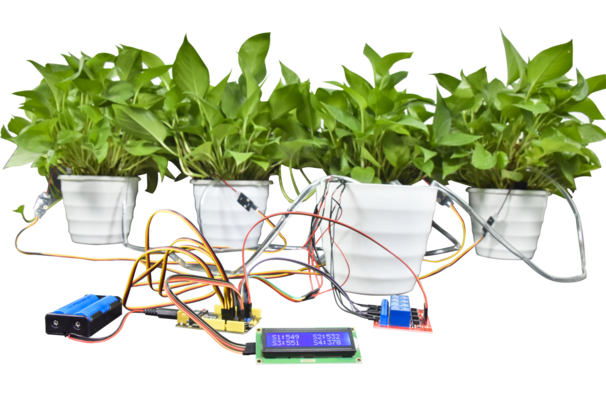

套件介绍
========

|image1|

简介
----

| 如果你热爱养花种草，却因为忙碌的生活而无暇顾及它们，导致鲜花枯萎、多肉失色，那么这款
  **Keyes DIY 电子自动浇水系统** 是你的理想选择。
| 这款自动浇花装置专为家庭阳台、办公室绿植和小型植物园设计，能够智能监测土壤湿度并自动浇水。它配备了
  **4个土壤湿度传感器** 和 **水泵**\ ，可以同时照料多达
  **4个盆栽**\ ，并通过显示屏实时显示土壤湿度值，让你轻松掌控植物的健康状况。

产品特点
--------

- **智能监测**\ ：内置土壤湿度传感器，实时检测土壤湿度，精准判断是否需要浇水。
- **多盆支持**\ ：支持同时监控和灌溉
  **4个不同的植物盆栽**\ ，满足多植物养护需求。
- **自动浇水**\ ：根据土壤湿度值自动启动水泵灌溉，无需手动操作。
- **实时显示**\ ：搭载显示屏，清晰显示每个传感器的湿度值，直观了解植物的需求。
- **DIY乐趣**\ ：模块化设计，适合电子爱好者和种植爱好者自己组装，享受动手的乐趣。
- **节水环保**\ ：精准灌溉，避免过度浇水，节约用水，保护环境。
- **适用广泛**\ ：适用于室内阳台、办公室、庭院等各种场景。

技术参数
--------

- **供电电压**\ ：5V DC
- **土壤湿度传感器数量**\ ：4个
- **水泵数量**\ ：1个
- **显示屏类型**\ ：液晶显示屏（LCD）
- **控制方式**\ ：湿度检测自动控制
- **最大灌溉距离**\ ：1米
- **适用环境**\ ：室内或半户外
- **安装方式**\ ：DIY组装

产品清单
--------

1. **土壤湿度传感器** × 4
2. **水泵** × 1
3. **水管** × 4（适配4个盆栽）
4. **显示屏模块** × 1
5. **控制主板** × 1
6. **电源线** × 1
7. **连接线** × 若干
8. **4路继电器模块** × 1

应用场景
--------

- **家庭阳台**\ ：照顾多肉植物、花卉、绿植等。
- **办公室**\ ：保持绿植健康，为办公环境增添生机。
- **庭院小型植物园**\ ：轻松管理多种植物，节省时间和精力。

