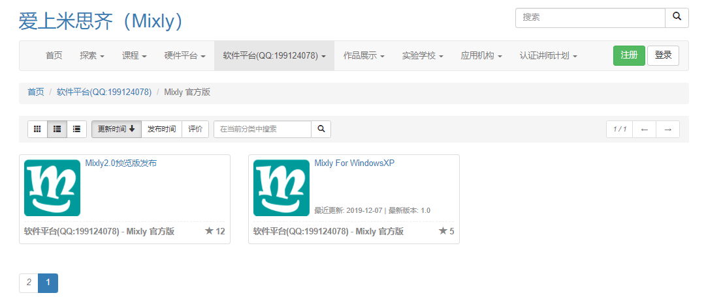
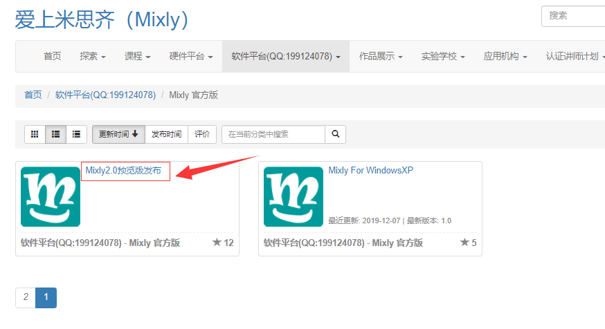
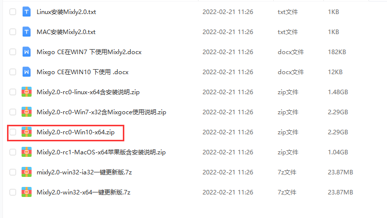
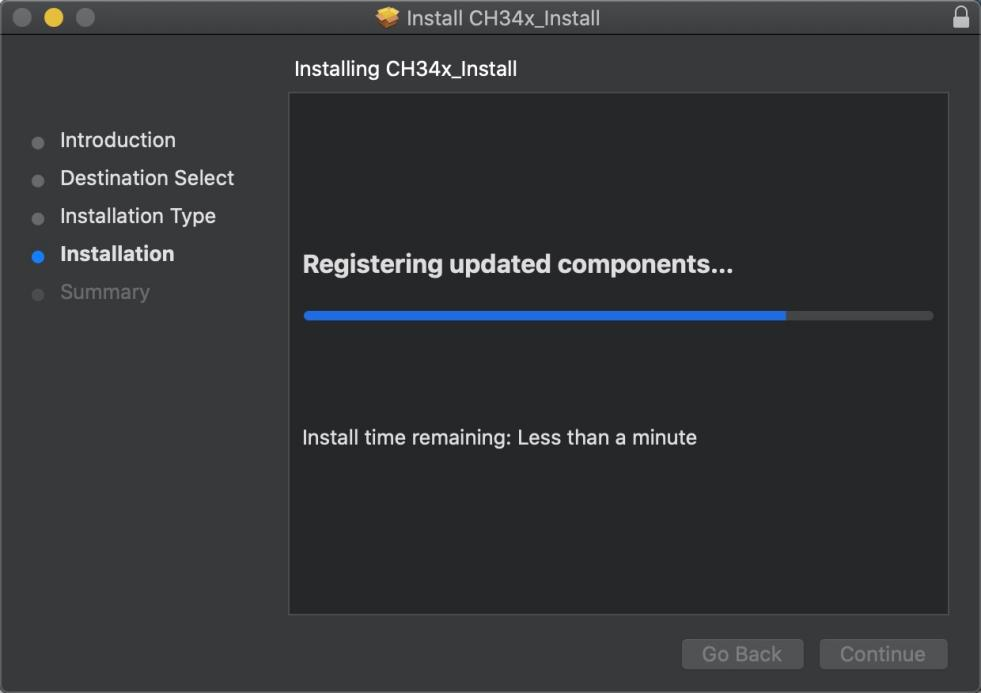
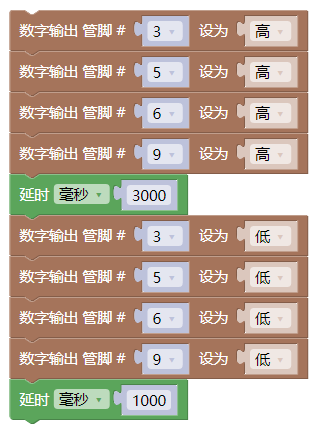
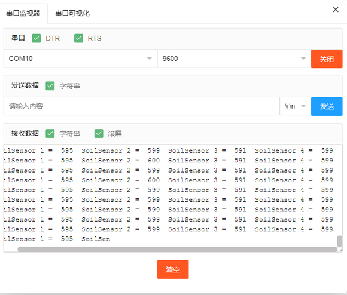
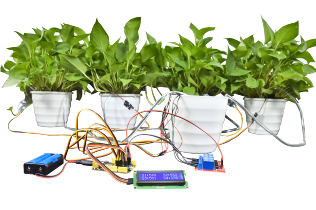

Mixly 教程
==========

**安装米思奇软件和开发板驱动**

|image1|

第一小节 控制板简介
-------------------

我们先了解浇花系统的核心：控制板

|image2|

控制板的主控芯片是ATmega328PB-AU。和官网的Arduino
uno对比，控制板使用的USB转串口芯片为CH340，其他的使用方法完全一样。它具有14路数字输入/输出口（其中6路可作为PWM输出），8路模拟输入，通信IO有IIC、SPI、UART;为了方便接线扩展了传感器排针接口。其中ICSP接口用来给控制板烧录固件。供电方式有USB线供电或DC端供电。

规格参数
~~~~~~~~

主控芯片：ATmega328PB-AU

USB转串口芯片：CH340

工作电压：5V

外接电源: DC 6-15V（建议9V）

数字I/O引脚: 14 (D0-D13)

PWM通道： 6 (D3 D5 D6 D9 D10 D11)

模拟输入通道（ADC）: 8(A0-A7)

每个I/O直流输出能力: 20 mA

3.3V端口输出能力: 最大150 mA

Flash Memory: 32 KB

SRAM:2 KB (ATmega328PB-AU)

EEPROM:1 KB (ATmega328PB-AU)

时钟速度: 16MHz

板载LED引脚: D13

各个接口和主要元件说明
~~~~~~~~~~~~~~~~~~~~~~

|image3|

|image4|

特殊功能接口说明
~~~~~~~~~~~~~~~~

串口通信接口：D0为RX、D1为TX

PWM接口（脉宽调制）：D3 D5 D6 D9 D10 D11

外部中断接口：D2(中断0)和D3 (中断1)

SPI通信接口：D10为SS、D11为MOSI、D12为MISO、D13为SCK

IIC通信端口：A4为SDA、A5为SCL

第二小节 安装米思奇软件和开发板驱动
-----------------------------------

.. _1米思奇mixly软件下载和安装:

1.米思奇（Mixly）软件下载和安装
~~~~~~~~~~~~~~~~~~~~~~~~~~~~~~~

打开米思奇软件的官方网站https://mixly.org/explore/software/mixly-arduino，在页面可以看到Mixly2.0最新版和Mixly
For的其它版本

|image5|

点击Mixly2.0版，再点击Mixly2.0 RC网盘文件下载\ |image6|

|image7|

资料有四个系统版本的软件可以供选择，这里以WIN10-x64版本为例，现在的电脑大部分都是WIN10的系统，点击下载自己所需的软件版本

|image8|

下载好的是米思奇软件的压缩包。压缩包下载好之后，解压到电脑的其中一个硬盘（建议不要放在系统盘），Mixly2.0版本不用安装，解压出来就可以用了

|image9|

.. _2软件的更新:

2.软件的更新
~~~~~~~~~~~~

点击软件目录下的一键更新

|image10|

按提示输入“y”然后按下Enter键(回车键)即可自动安装，安装完成按下键盘的任意键即可退出

|image11|

鼠标右键点击Mixly.exe 发送到电脑桌面，方便日后我们使用。

|image12|

.. _3米思奇软件介绍:

3.米思奇软件介绍
~~~~~~~~~~~~~~~~

米思奇（Mixly）是一个免费的开源图形Arduino编程软件，基于Google的图形化编程框架。它是创意电子开发的免费开源图形编程工具；是完整支持创意电子教育的生态系统；是创客教育者实现梦想的舞台。

安装好了软件，我们点击电脑桌面上的mixly图标来打开软件，选择Arduino AVR

|image13|

|image14|

代码程序上传到Arduino开发板或者兼容板之前，必须先了解米思奇软件工具栏中出现的每个区和接口的功能。

界面布局

介绍面总的分为四大功能区域块。

1.基本功能块区

2.程序构建区

3.代码区

4.信息提示区

|image15|

基本功能块区

输入输出: IO相关功能块

控制: 程序流程控制相关功能块

数学: 数学运算相关功能块

文本: 字符串操作相关功能块

数组: 数组相关功能块

逻辑: 逻辑关系的相关功能块

串口: 串口通信相关功能块

通信: 以太网,红外遥控等通讯功能块

储存: 数据储存相关功能块 (高级视图)

传感器: 通用传感器相关功能块

执行器: 通用执行器相关功能块

显示器: 显示相关功能块

以太网:以太网通讯功能块(高级视图)

变量: 变量操作相关功能块

函数: 函数相关功能块

自定义模块: 自定义代码功能块(高级视图)

程序建构区

该区域为程序功能拼接区域。将功能块从左侧块区拖入程序建构区进行拼接。该区域的右下角有个垃圾桶，可以将不用的代码拖进去删除，也可以将不用的代码直接往最左方拖拽（模块选择区），同样可以删除代码。当然，点击不用的代码后点击键盘
Delete也可将代码删除，还可以右键点击块选择删除块.

|image16|

视图缩放

在垃圾桶的上方有两个图形，一个是 ⊕一个是Θ
。该图形可放大或缩小程序构建区模块

的大小。在⊕的上方有一个
按钮，这个按钮的功能是将模块的大小恢复至标准大小，并居中.

|image17|

功能切换

语言切换:在该区域的右上角的设置中，还可以切换语言显示的种类。

主题切换:在设置中主题可以进行普通视图和高级视图来进行视图之间的切换。

编程方式切换：在设置中的代码可以切换编程方式。

撤消/重做:撤销功能是当编写代码时误删模块后，便可以点击左箭头或者直接按
Ctrl+Z 来恢复误删代码；而重做则是和 Ctrl+Z 相反。

|image18|

文件操作区

新建:新建项目文件

打开:打开项目文件

保存:保存项目文件

另存为:另存项目文件

导出库:导出当前项目为库文件

导入库:导入第三库文件

管理库:库的删除和重命名等操作

|image19|

库文件是为了方便代码分享.将一个功能集成在个函数中。之后导出库
文件.就可以分享给他人使用.

代码区

点击代码可以对当前模块自动生成的代码进行修改，修改后如不切换回图形区,进行编译和下载,将按照修改的代码进行编译或者下载.但如果切换回图形区.代码会恢复为图形区的代码.

|image20|

程序下载及串口监视

编译: 将程序编译为机器执行码.编译过程和结果会在信息显示区显示

上传: 编译程序并上传至主板,上传信息会在信息显示区显示.

主板选择: 选择主板类型及连接的端口

串口监视:
用于监视主板从串口发来的信息或者给主板发送信息.需编程.主要用于调试程序或者显示信息用.

|image21|\ 需要注意的是在上传程序时请关闭串口监视窗口.否则会导致程序上传失败

第三小节 安装驱动
-----------------

（注意：如果电脑已经安装了CH340驱动程序，则不需要再安装驱动；如果没有，则需要进行以下操作）

Windows上安装驱动
~~~~~~~~~~~~~~~~~

|image22|

安装Mixly后，我们就开始安装驱动。将控制板用USB线连接在电脑上后，如果是Windows10系统电脑，电脑会自动安装驱动。如果是其他系统电脑，如Windows7系统电脑，需要手动安装驱动。

控制板的USB转串口芯片为CH340我们需要安装这芯片的驱动，驱动为usb_ch341_3.1.2009.06。第一次将控制板连接电脑时，点击计算机–属性–设备管理器，显示如下图。

|image23|

点击 |image24|\ 后，点击“更新驱动程序” ，开始安装驱动，如下图。

|image25|

进入下图，选择

|image26|

在电脑中找到usb_ch341_3.1.2009.06文件夹。

|image27|

安装驱动完成，出现下图点击关闭。

.. _2在mac-系统电脑上安装驱动方法:

2.在MAC 系统电脑上安装驱动方法
~~~~~~~~~~~~~~~~~~~~~~~~~~~~~~

|image28|

(1)点击V1.5 CH340 MaxOS驱动程序包

|image29|

（2）单击安装包并点击继续

|image30|

（3）点击安装

|image31|

（4）输入用户密码，然后单击“安装软件

|image32|

（5）点击继续安装

|image33|

（6）等待安装

|image34|

（7）安装完成后，单击“重新启动”

|image35|

|image36|

总接线图
--------

|image37|

水管接到水泵上：

|image38|

母对母的杜邦线接到水泵的正极也就是红色线，再与主板的5V排针连接。

|image39|

代码编写教程
------------

实验一：控制继电器和水泵
~~~~~~~~~~~~~~~~~~~~~~~~

（1）实验说明：

继电器就是个电动开关，水泵是动力装置。通过继电器开关来控制水泵是否抽水。

（2) 水泵规格参数：

+----------------+----------------+----------------+----------------+
| 水泵           | 水泵           | 继电器         | 继电器         |
+================+================+================+================+
| 工作电压：     | 2.5V~6V        | 工作电压       | DC5V           |
+----------------+----------------+----------------+----------------+
| 配对的水管内径 | 6mm            | 通过最大电流   | 10A(AC)        |
|                |                |                | 5A(DC)         |
+----------------+----------------+----------------+----------------+
| 当电压为5V时   | 水             | 通             | 250VAC  30VDC  |
|                | 管离水泵的高度 | 过最大开关电压 |                |
|                | 不能高于105cm  |                |                |
+----------------+----------------+----------------+----------------+
|                |                | 触发信号       | 高电平触发     |
+----------------+----------------+----------------+----------------+

（3）实验程序：

可以直接打开我们编写好的程序：点击文件下的打开然后找到Mixly教程的实验1
程序

|image40|

也可以自己通过拖动代码块来编写程序

|image41|

上传程序：选择正确串口，波特率是：9600；控制板选择Arduino
uno板；然后点击上传程序，程序上传成功会提示上传成功。

|image42|

（4）实验现象：

上传程序之后，可以看到4个继电器同时打开，水泵开始抽水，3秒后停止。

实验二 读取土壤传感器检测数值
~~~~~~~~~~~~~~~~~~~~~~~~~~~~~

（1）实验说明：

土壤湿度传感器就是用来检测土壤湿度值的，也就是通过检测到的值可以判断盆栽是否缺水；读取4个土壤湿度传感器，并且在Mixly串口监视器中打印出来。

2. 规格参数

控制芯片：TLC555

通信接口：输出模拟值

额定电压：3.3 ~ 5.5 VDC

输出电压：0 ~ 3.0 VDC

工作电流：<5mA

工作温度范围：1°C ~ 50°C

（3）实验程序：

|image43|

（4）实验现象：

烧录好程序，打开Mixly串口监视器，可以看到打印出4个土壤湿度传感器检测到的值，用手触摸土壤湿度传感器的探测部分，可以看到对应的值变小，这是因为人的手皮肤上有水分，也就意味着土壤越湿测到的值越小。

|image44|

实验三 简单自动浇花装置
~~~~~~~~~~~~~~~~~~~~~~~

（1）实验介绍：

既然学会了控制水泵和读取土壤湿度传感器的值，那就可以通过判断土壤湿度传感器检测到的值来开关继电器，实现简单的自动浇花装置。

（2）实验程序：

|image45|

|image46|

（3）实验现象：

为了方便做实验，我们还是先用手触摸土壤湿度传感器来替代盆栽缺水的情况。烧录代码后，用手触摸土壤湿度传感器，对应的继电器打开，水泵抽水，放开手后，继电器关闭，水泵停止抽水。

实验四 控制LCD1602显示屏
~~~~~~~~~~~~~~~~~~~~~~~~

（1）简介

这是一个可以显示2行，每行16个字符的液晶屏模块。液晶屏显示蓝底白字，自带I2C通信模块，使用时只需连接单片机I2C通信接口，大大节约了单片机资源。I2C通信模块上带有1个电位器，可用于调节显示屏背光，通信地址默认为0x27。

（2）实验程序：

|image47|

（3）实验现象：

可以看到LCD1602显示屏第一行显示：keyes ；第二行显示： Hello World! 。

实验五 LCD1602显示土壤传感器检测到的值
~~~~~~~~~~~~~~~~~~~~~~~~~~~~~~~~~~~~~~

（1）实验说明

土壤湿度传感器检测到的值，可以通过打开Mixly串口监视器查看，但是需要使用数据线连接电脑，很不方便。所以我们添加了个LCD1602显示屏，可以在显示屏上看土壤湿度传感器检测到的值。

（2）规格参数

工作电压：DC 5V

接口：间距为2.54mm排针接口

通讯方式：I2C通讯

I2C通信地址: 0x27

（3）实验程序：

|image48|

（4）实验现象：

S1代表土壤湿度传感器1，以此类推，可以看到LCD1602显示屏显示出4个传感器检测到的值，用手触摸传感器，可以看到显示屏上显示的值在改变。

|image49|

实验六 自动浇花装置
~~~~~~~~~~~~~~~~~~~

1. 实验程序：

|image50|

|image51|

（2）实验现象：

四个土壤湿度传感器分别插到4个盆栽土壤里，对应的控制的水泵水管也放到盆栽里，可以看到LCD1602显示屏显示出盆栽的土壤湿度值。如果盆栽不缺水，10秒后LCD1602显示屏的背景灯会关闭，达到省电作用。如果有盆栽缺水了，LCD1602显示屏背景灯会亮起，对应盆栽的继电器打开水泵抽水到盆栽，3秒后继电器关闭，水泵停止抽水，等待5秒给水渗透时间，然后土壤湿度传感器再继续检测。(因土壤传感器的检测原理是：湿度越大数值越小，所以当土壤的湿度大于550时水泵开始抽水，数值小于550就停止抽水)

|image52|

.. |image1| image:: media/851934063e3365a06a6d47afa8007b2e.jpeg
.. |image2| image:: media/dde5c6ed1198136fa5225bb4c47c7c38.jpeg

.. |image6| image:: media/de136c8dce91784f3d37cb383a997ec1.png

.. |image12| image:: media/834034709efebaa4961bbcb9c27ff190.png
.. |image13| image:: media/160d414d91186533404516d602e824c9.png

.. |image22| image:: media/6cf6312dc7c7db27794b54d58a8bf80c.png

.. |image25| image:: media/504caa6acc2846fa4673e8b4ca1732cc.png

.. |image27| image:: media/2c6a65e618660291e668adf6d0d782ad.png
.. |image28| image:: media/a6fc83596009c574d8e29ef383748549.png

.. |image30| image:: media/a0d569d2d2bc88e3ac59c5879e45b3e8.jpeg
.. |image31| image:: media/3f84876b31e5b56a0e2d7aa42ce04ac5.jpeg
.. |image32| image:: media/8ea217a173dca85e0ab1c2ed54e40024.jpeg
.. |image33| image:: media/6fd24b8f9d43ec10e1b529b370f954aa.jpeg

.. |image35| image:: media/07291e8ae8616258c8b52d71e5fc1bd0.jpeg

.. |image37| image:: media/701d346b17a609db126eb958d032938d.png

.. |image39| image:: media/f08ba895010e46dc44bf80a5f80b5904.png
.. |image40| image:: media/06a62182958d1f451a31a04cccaf3e79.png

.. |image49| image:: media/af9d308d1fb383e2b034d6a38f0a7c58.png

